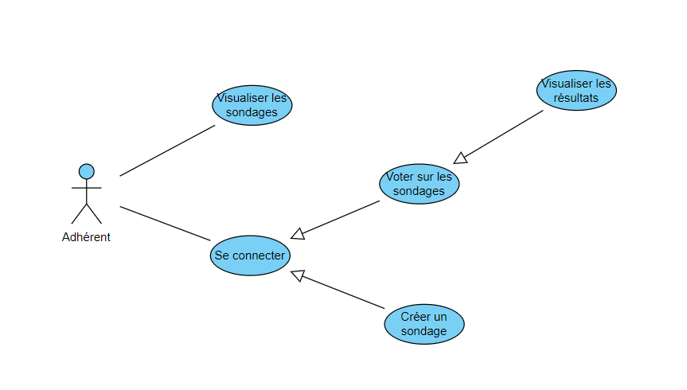

# Application "Palmoodle" pour **Lyon Palme**

## Sommaire

- [Description](#description)
- [Diagramme de cas d'utilisation](#cas)
- [Technologies utilisées](#technologies)
- [Prérequis](#prérequis)
- [Utilisation](#utilisation)

## Description 

Le club « Lyon Palme » est une association sportive de nage avec palme. Il compte une quarantaine d’adhérents, son siège est à Saint Fons.

L'application Palmoodle servira à récolter régulièrement l'avis des adhérents sur des sujets divers et variés. Etant une application interne, les adhérents pourront visualiser la liste des sondages et des réponses mais devront se connecter afin de voter et créer des sondages.

## Diagramme de cas d'utilisation

## Technologies utilisées 

| Ressources | Description |
| ------ | ------ |
| Gitlab | Plateforme de développement collaborative |
| MariaDB | Système de gestion de base de données |
| VueJS | Framework JavaScript pour le Front |
| Laravel | Framework MVC open source pour l'API |

## Utilisation 

### _Dans le cas où l'application est dans la ferme_ :

L'application est stockée sur ma VM FrontEnd en vous connectant avec les identifiants suivants:

| Nom d'utilisateur | Mot de passe |
| ------ | ------ |
| djangoeleve | mdp_djangoeleve |

Il vous suffira de vous rendre dans le terminal et effectuez la commande "cd /websites/vuejs/palmoodle". Une fois dans le bon répertoire vous pouvez faire la commande "npm run dev" et vous rendre sur le lien http://localhost:5173/ dans le navigateur afin de lancer l'application.

### _Dans le cas où l'application n'est pas dans la ferme_ :

Pour commencer, ouvrez la VM Debian puis installez-y nvm, node.js, and npm. Vous devrez installer les extensions Prettier et EsLint afin de mener à bien l'exécution du projet puis vous pourrez enfin clôner le projet dans le dossier "/websites/vuejs".

Récupérez également l'API placé dans le dépôt Gitlab ci-dessous et suivez les étapes d'installation expliqué dans le readme.md :
"http://gitlab.chassagnes.local/grp_sio2/grp_sio2_slam/laravel/sondage"

(Pensez à clôner le projet dans le dossier "/websites/laravel" de votre Debian)

Il vous reste à faire la commande "npm run dev" pour ensuite vous rendre sur le lien http://localhost:5173/ dans votre navigateur et visualiser l'application.
